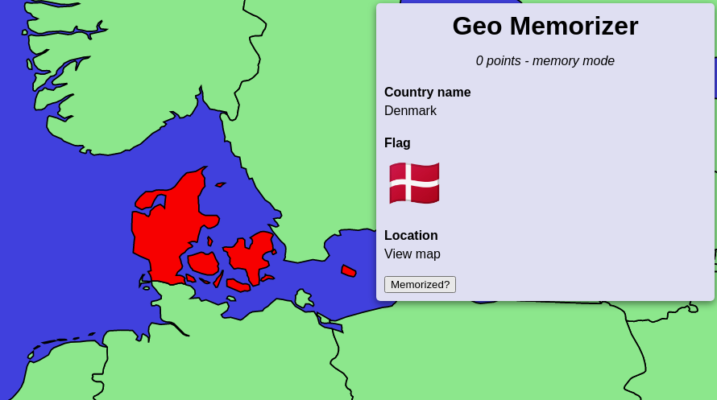
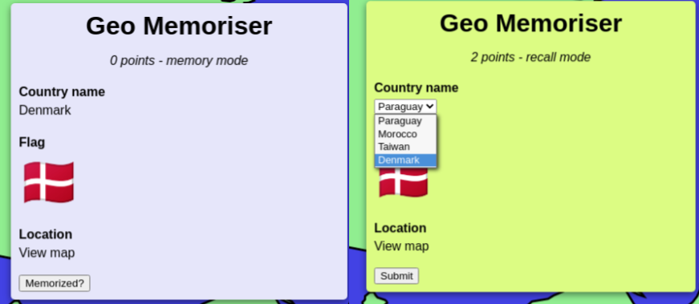

<h1 align="center">Geo memorizer</h1>

<b>A game to help you learn the name, flag, and location of every country.</b>

<i>Read the blog post about it <a href="https://carltheperson.com/posts/geo-memorizer/">here</a></i>

# How to play

You can play the game [here](https://geo-memorizer.web.app/). It works best in Chrome.

You pan around by clicking and dragging. You zoom by scrolling.

There are two modes in the game. _Memory mode_ and _recall mode_. In memory mode, you are supposed to remember all three facts (name, flag, and location) presented about the country. Later in recall mode, you will be asked to recall **one** of the facts. If you recall correctly, you get a point. If you don't, you lose all your points.

# Thanks to

- Contributors and maintainers of [d3.js](https://github.com/d3/d3) and [d3-geo](https://github.com/d3/d3-geo)
- [naturalearthdata.com](https://www.naturalearthdata.com/) and whoever put its data on [UNPKG](https://unpkg.com/browse/world-atlas@2.0.2/README.md) in TopoJSON
- Curran Kelleher for his awesome [Youtube video](https://www.youtube.com/watch?v=Qw6uAg3EO64) about creating a world map with d3

# License

This project is licensed under the MIT License - see the [LICENSE](LICENSE) file for details
